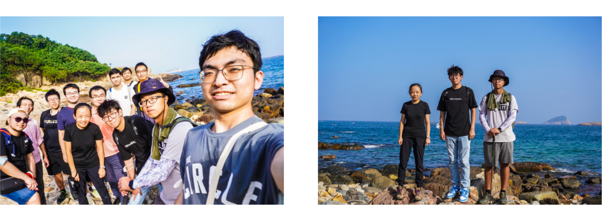

WELCOME TO THE LI LAB IN THE DEPARTMENT OF PHYSICS AT CITY UNIVERSITY OF HONG KONG.

The Li Lab examine molecules and bio-inspired architectures at the single molecule level to spark advances in electronics, health, and sustainability.

---
 NEWS 

---

**

**November 2022** We went hiking with the Zhang Group and Li Group in clear water bay.

**September 2022** The lab welcomes new graduate student Weiyi Guo.

**July 2022** The lab welcomes new graduate student Jianming An.

**June 2022** Haixing receives the Early Career Scheme from the Research Grants Council (Hong Kong).
