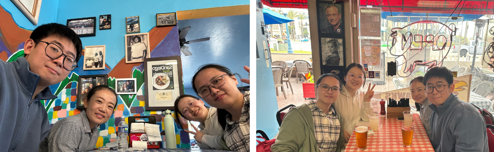
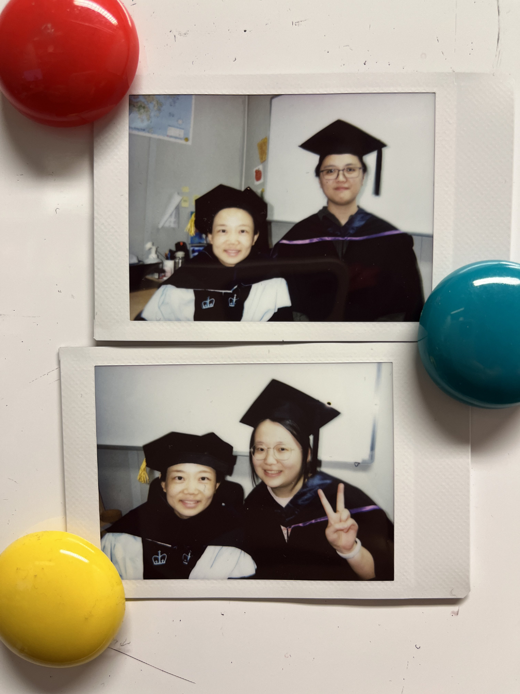
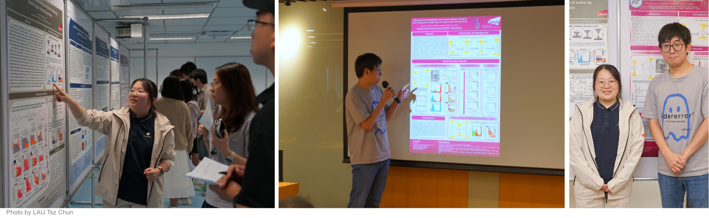
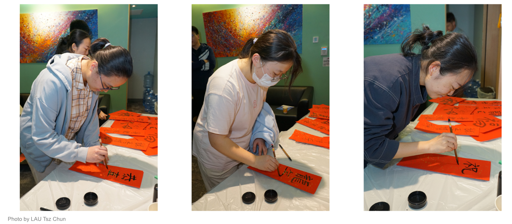
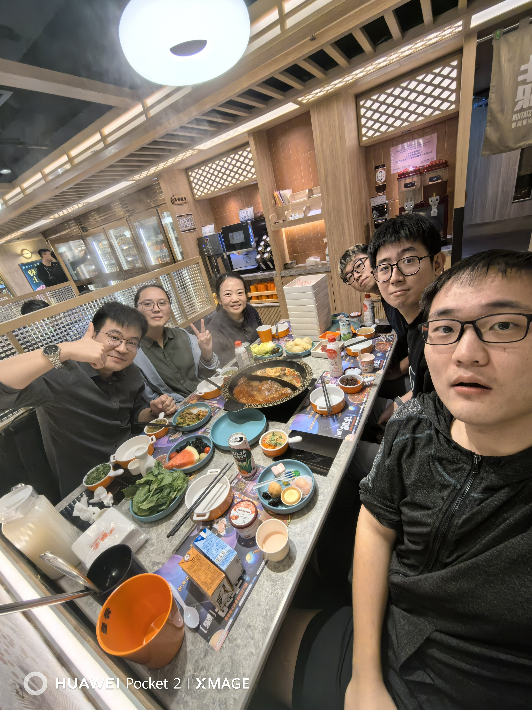
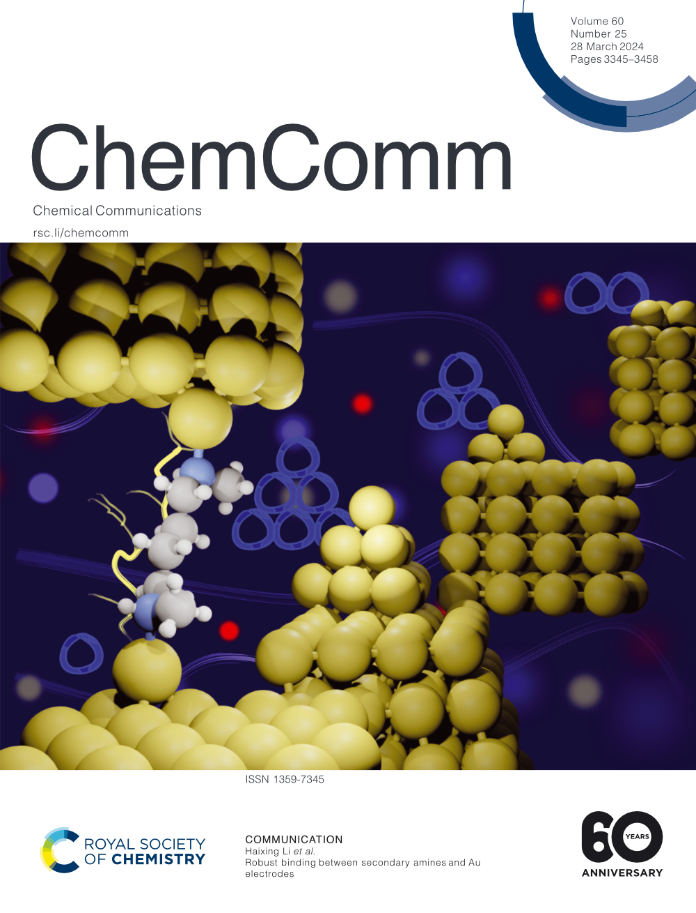
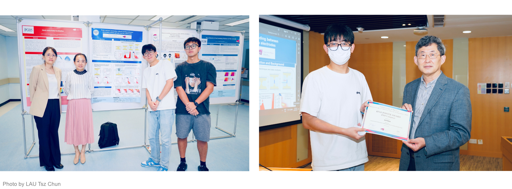
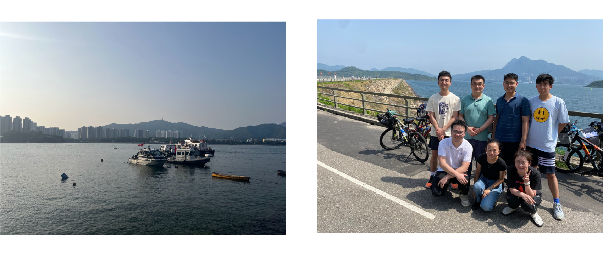

WELCOME TO THE LI LAB IN THE DEPARTMENT OF PHYSICS AT CITY UNIVERSITY OF HONG KONG.

The Li Laboratory examines molecules and develops measurement tools at the single-molecule level to spark advances in electronics and sustainability.

---

 NEWS 

---

<code style="color : lightblue"> 2025 </code>

*<code style="color : lightblue">October 2025.</code>*
Xueling's first first-author paper on Distinguishing Quantum Interference in Meta-connected Molecular Systems in collaboration with Moses Adeyemo from [Zhenfei Liu's group](https://liugroupwsu.weebly.com/) and Lulu Xiong from [Jianlong Xia's group](https://www.jianlongxia.cn/) is now published in Physical Review B.

*<code style="color : lightblue">September 2025.</code>*
The lab celebrates Yihao's and Yaran's passing of their qualifying exams.

*<code style="color : lightblue">September 2025.</code>*
Yidong starts his PhD. The lab welcomes new master students Zujun Li, Abdul Mateen Hassan, and Jiakun Song. The lab welcomes a new undergraduate student Audric Martin Tjen.

*<code style="color : lightblue">August 2025.</code>*
Weiyi and Yaran both won the Research Tuition Scholarship from the School of Graduate Studies!

*<code style="color : lightblue">August 2025.</code>*
Weiyi and Yaran both won the Outstanding Academic Performance Award from the School of Graduate Studies, in recognition of their outstanding academic performance in their research studies in the last twelve months. Very well deserved!

*<code style="color : lightblue">August 2025.</code>*
Haixing receives the National Natural Science Foundation of China Young Scientist Fund Scheme C.

*<code style="color : lightblue">July 2025.</code>*
Weiyi and Yihao's review paper on linking molecules to metal surfaces with covalent bonds is now published in Physical Chemistry Chemical Physics.

*<code style="color : lightblue">March 2025.</code>*
The lab contributed 3 oral and 1 poster presentations at the ACS meeting in San Diego.

    

*<code style="color : lightblue">February 2025.</code>*
The lab welcomes a new undergraduate student Ho tak To.

*<code style="color : lightblue">January 2025.</code>*
Yaran's work on protonation-independent charge transport across diphenylamine single-molecule junctions is now published in The Journal of Physical Chemistry Letters!

---

<code style="color : lightblue"> 2024 </code>

*<code style="color : lightblue">November 2024.</code>*
The lab welcomes a new research assistant Yidong Xiao.

*<code style="color : lightblue">September 2024.</code>*
Weiyi's work on covalent Au-C contact formation and C-C homocoupling reaction in single-molecule junctions in collaboration with Yuhao from [Zhenpin Lu's group](https://staffweb1.cityu.edu.hk/zhenpilu/index.htm) is now published in JACS!

*<code style="color : lightblue">September 2024.</code>*
We celebrate Song's passing of his qualifying exam.

*<code style="color : lightblue">September 2024.</code>*
Xueling (joint with the Lei group), Yihao, and Yaran start their PhDs in the group! The lab welcomes a new undergraduate student Shaarib.

*<code style="color : lightblue">August 2024.</code>*
Our collaboration with the [group of Jianlong Xia](https://www.jianlongxia.cn/) and [group of Carmen Herrmann](https://www.chemie.uni-hamburg.de/en/institute/ac/arbeitsgruppen/herrmann.html) is out in The Journal of Physical Chemistry Letters.

*<code style="color : lightblue">June 2024.</code>*
Farewell, Yao! Good luck on your PhD study at the University of Notre Dame.

*<code style="color : lightblue">June 2024.</code>*
Xueling and Yihao are the group's first graduating master students. Congratulations!

    

*<code style="color : lightblue">June 2024.</code>*
So proud of our group members, Yihao and Weiyi, for both winning the poster award at PHY annual symposium!

    

*<code style="color : lightblue">May 2024.</code>*
Our editorial about a themed collection on molecular scale electronics with [Tim Su](https://teamsu.org/) and [Mike Inkpen](https://www.inkpenlab.org/) is now online.

*<code style="color : lightblue">May 2024.</code>*
Song Han and Xiu Liang's review article (a nice collaboration with [the Lei group](https://personal.cityu.edu.hk/dangylei/index.html)) discusses optical and charge transport characteristics of photoswitching plasmonic molecular systems.

*<code style="color : lightblue">April 2024.</code>*
The lab welcomes a new research assistant Yaran Cheng.

*<code style="color : lightblue">Feb 2024.</code>*
The lab welcomes a new research assistant Yao Huo.

*<code style="color : lightblue">Feb 2024.</code>*
We start 2024 lunar new year with red paper handwriting.

    

    

*<code style="color : lightblue">Feb 2024.</code>*
Weiyi's first first-author paper on robust binding between secondary amines and Au electrodes is published in [Chemical Communications](https://pubs.rsc.org/en/content/articlelanding/2024/cc/d3cc04284g)! And we are on the cover:

    

---

<code style="color : lightblue"> 2023 </code>

*<code style="color : lightblue">September 2023.</code>*
The lab celebrates Jianming's and Weiyi's passing of their qualifying exams and advancing to Ph.D. candidacy.

*<code style="color : lightblue">September 2023.</code>*
The lab welcomes a new master student Yihao Zhang, a new master student/research assistant Xueling Xu, and a new graduate student Song Han.

*<code style="color : lightblue">June 2023.</code>*
Haixing receives the GRF from the Research Grants Council of Hong Kong.

*<code style="color : lightblue">June 2023.</code>*
Congratulations to Weiyi for winning the best poster award at PHY annual symposium.

    

*<code style="color : lightblue">April 2023.</code>*
The semester ends with a joint biking event with the Zhang Group.

    

*<code style="color : lightblue">March 2023.</code>*
The Lu Group from Chemistry Department and the Li group receive a strategic interdisciplinary research grant from CityU.

*<code style="color : lightblue">January 2023.</code>*
Haixing receives a teaching start-up grant from CityU.

---

<code style="color : lightblue"> 2022 </code>

*<code style="color : lightblue">November 2022.</code>*
The lab went hiking with the Zhang Group and the other Li Group in Clear Water Bay.

    

*<code style="color : lightblue">September 2022.</code>*
The lab welcomes a new graduate student Weiyi Guo.

*<code style="color : lightblue">July 2022.</code>*
The lab welcomes a new graduate student Jianming An.

*<code style="color : lightblue">June 2022.</code>*
Haixing receives the Early Career Scheme grant from the Research Grants Council of Hong Kong.
