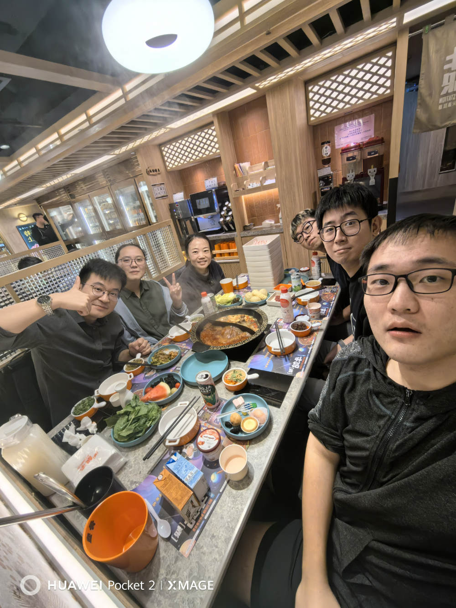

WELCOME TO THE LI LAB IN THE DEPARTMENT OF PHYSICS AT CITY UNIVERSITY OF HONG KONG.

The Li Lab examine molecules and develop measurement tools at the single molecule level to spark advances in electronics and sustainability.

---

 NEWS 

---

<code style="color : lightblue"> 2024 </code>

*<code style="color : lightblue">April 2024.</code>*
The lab welcomes a new research assistant Yaran Cheng.

*<code style="color : lightblue">Feb 2024.</code>*
The lab welcomes a new research assistant Yao Huo.

*<code style="color : lightblue">Feb 2024.</code>*
We start 2024 lunar new year with red paper handwriting.

    

    

*<code style="color : lightblue">Feb 2024.</code>*
Weiyi's first first-author paper on robust binding between secondary amines and Au electrodes is published in [Chemical Communications](https://pubs.rsc.org/en/content/articlelanding/2024/cc/d3cc04284g)! And we are on the cover:

    

---

<code style="color : lightblue"> 2023 </code>

*<code style="color : lightblue">September 2023.</code>*
The lab celebrates Jianming's and Weiyi's passing of their qualifying exams and advancing to Ph.D. candidacy.

*<code style="color : lightblue">September 2023.</code>*
The lab welcomes a new master student Yihao Zhang, a new master student/research assistant Xueling Xu, and a new graduate student Song Han.

*<code style="color : lightblue">June 2023.</code>*
Haixing receives the GRF from the Research Grants Council of Hong Kong.

*<code style="color : lightblue">June 2023.</code>*
Congratulations to Weiyi for winning the best poster award at PHY annual symposium.

    

*<code style="color : lightblue">April 2023.</code>*
The semester ends with a joint biking event with the Zhang Group.

    

*<code style="color : lightblue">March 2023.</code>*
The Lu Group from Chemistry Department and the Li group receive a strategic interdisciplinary research grant from CityU.

*<code style="color : lightblue">January 2023.</code>*
Haixing receives a teaching start-up grant from CityU.

---

<code style="color : lightblue"> 2022 </code>

*<code style="color : lightblue">November 2022.</code>*
The lab went hiking with the Zhang Group and the other Li Group in Clear Water Bay.

    

*<code style="color : lightblue">September 2022.</code>*
The lab welcomes a new graduate student Weiyi Guo.

*<code style="color : lightblue">July 2022.</code>*
The lab welcomes a new graduate student Jianming An.

*<code style="color : lightblue">June 2022.</code>*
Haixing receives the Early Career Scheme grant from the Research Grants Council of Hong Kong.
